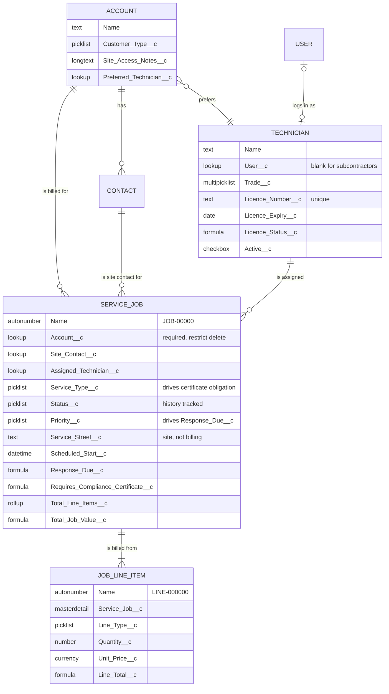

# Phase 1 — Data model design

> **Simulation.** Meridian Field Services Pty Ltd is fictional. No real customer
> data appears in this document or in the org it describes.

**Phase:** 1 of 18 · **Status:** built · **Date:** 4 September 2026

---

## What the business does, and what that means for the model

Meridian sends eight field workers to about 40 jobs a week across Sydney,
across three trades. Everything they do is organised around one unit of work:
somebody's hot water is out, a technician goes, something gets fixed, an invoice
goes out. That unit — not the customer, not the invoice — is what the whole org
has to be built around, because it is the thing that gets scheduled, argued
about, and paid for.

Four facts from the brief drove the model more than anything else:

1. **The person billed is often not the person on site.** Strata managers,
   real estate agents and the public housing trust are three of the largest
   customers, and none of them are ever at the property. Billing address and
   service address are different things and cannot share a field.
2. **Half the workforce has no Salesforce login.** Subcontractors do the
   overflow work. They still need licences tracked and jobs assigned to them.
3. **Electrical and HVAC work carries a statutory certificate obligation.**
   NSW requires a certificate for that work; plumbing generally does not. The
   obligation follows the trade, so it must be derived from the trade rather
   than remembered by a person.
4. **Jobs are billed from lines, not from a lump sum.** Labour, parts, callout
   fee, disposal. The owner cannot currently see margin because the spreadsheet
   records one number per job.

## Entity relationship diagram



## The objects

| Object | API name | Records | Fields | Sharing |
|---|---|---|---:|---|
| Service Job | `Service_Job__c` | ~2,000/year | 29 | Public Read/Write → Private in Phase 8 |
| Job Line Item | `Job_Line_Item__c` | ~4 per job | 9 | Controlled by Parent |
| Technician | `Technician__c` | 8 | 11 | Public Read/Write |
| Account | standard | 17 | +3 custom | Public Read/Write |

Contacts and Accounts are standard objects, unmodified beyond three custom
fields. Nothing about a plumbing company's customer list justifies a custom
object, and using the standard ones keeps duplicate management, the merge tool
and every out-of-the-box report available for free.

---

## Decisions

### Why not Field Service Lightning

FSL is the product answer for exactly this business: work orders, service
appointments, a dispatcher console, a scheduling optimiser and a mobile app that
works offline, all built. A real engagement would evaluate it before writing a
single custom field.

It is out of scope here for two reasons, and both should be stated plainly
rather than glossed over. The licence cost is disproportionate for eight field
workers — a dispatcher licence plus per-technician licences is real money
against a business at this size. And the purpose of this project is to
demonstrate configuration skill on the core platform; configuring a managed
package would demonstrate something different.

The honest consequence: this model reimplements a thin slice of what FSL does
properly, and it does not attempt the scheduling optimiser, the offline mobile
experience, or the crew and asset models at all. If Meridian grew to 40
technicians, the right advice would be to migrate to FSL, and this data model
maps onto it cleanly — Service Job to Work Order, Job Line Item to Work Order
Line Item, Technician to Service Resource.

### Why Technician is its own object rather than the User object

The obvious move is to put trade, licence and rate on the User record and assign
jobs to a user. It fails on the first subcontractor.

Roughly half of Meridian's field workforce are subcontractors who never log in.
Modelling them as Users means either buying licences for people who will never
open Salesforce, or creating inactive users — which cannot own records or be
looked up. A custom object holds every technician on the same footing, licensed
or not, and carries an optional `User__c` lookup for those who do log in. When a
subcontractor is taken on permanently, the lookup gets populated and nothing
else changes.

The cost: job assignment does not confer record ownership, so the Phase 8
sharing rule has to grant technicians access to their jobs through a criteria-
based rule against the `User__c` lookup rather than through ownership. That is
more configuration than ownership-based sharing would need, and it is the price
of modelling the workforce as it actually is.

### Why Job Line Item is master-detail, not lookup

Three reasons, in order of weight:

1. **Roll-up summaries need it.** `Total_Line_Items__c` is the reason the owner
   can see job value at all. Roll-up summary fields require a master-detail
   relationship; there is no declarative alternative.
2. **A line has no meaning without its job.** An orphaned line item is not a
   record with a missing reference — it is nonsense. Master-detail enforces that
   at the platform level, and cascade delete means closing out a cancelled job
   does not leave debris.
3. **Security should be inherited, not restated.** A line item is not more or
   less sensitive than the job it belongs to. Controlled by Parent means the
   Phase 8 sharing work is done once on Service Job and applies to lines
   automatically.

`reparentableMasterDetail` is false. Moving a line from one job to another is
not a legitimate operation — if a line was billed to the wrong job, the correct
fix is to delete it and add it to the right one, so that the mistake is visible
rather than quietly relocated.

### Why the service address is not the standard address field

Salesforce's compound address field on Account holds the billing address, which
for a strata manager is an office in the CBD and for a real estate agent is a
shopfront. The job happens somewhere else entirely, and the same customer has
many somewhere-elses.

So the site address is four fields on the job itself: street, suburb, state,
postcode. State is a restricted picklist rather than free text, because the
legacy spreadsheet held `NSW`, `nsw`, `N.S.W.` and `New South Wales` for the
same state and the reporting could never group by it. Postcode is Text, not
Number — leading zeros exist outside NSW and a number field silently eats them.

A geolocation field is included for the Phase 16 mobile arrival stamp, unused
until then.

### Why the compliance certificate flag is a formula

`Requires_Compliance_Certificate__c` could have been a checkbox someone ticks.
It is a formula on Service Type instead, because the obligation is a fact about
the trade rather than a judgement about the job — and because a checkbox can be
unticked by whoever is trying to close a job at 5pm on a Friday, which is
precisely the moment the Phase 5 validation rule exists to survive.

The same reasoning applies to `Line_Total__c` and `Total_Job_Value__c`. A stored
value can drift from its inputs. A formula cannot.

`Response_Due__c` follows the same rule. Storing a deadline would leave a stale
value behind the first time somebody changes a job's priority.

### Why restricted picklists

Every picklist on these objects is restricted. The API will refuse a value that
is not in the set, which means a bad integration or a careless Data Loader run
cannot quietly introduce a twelfth status value that no report knows about.
This is the single cheapest data-quality control available and it costs nothing
but a conversation each time a genuine new value is needed.

### Why sharing starts at Public Read/Write

Service Job ships in this phase with the default org-wide setting, and tightens
to Private with a role hierarchy in Phase 8. That is a deliberate sequence, not
an oversight: the security model is designed against a data model that exists
and a set of roles that have been thought through, and Phase 8 is where that
thinking happens. Recording the change in git history is more honest than
configuring Private on day one and presenting the security model as though it
arrived fully formed.

---

## Field inventory

### Service_Job__c — 29 fields

| Field | Type | Notes |
|---|---|---|
| `Name` | Auto Number | `JOB-{00000}` |
| `Account__c` | Lookup (Account) | Required, delete restricted |
| `Site_Contact__c` | Lookup (Contact) | Often not the bill payer |
| `Assigned_Technician__c` | Lookup (Technician) | History tracked |
| `Service_Type__c` | Picklist | Plumbing / Electrical / HVAC / Multi-trade |
| `Job_Type__c` | Picklist | Callout, maintenance, installation, quote, warranty |
| `Priority__c` | Picklist | P1–P4, drives `Response_Due__c` |
| `Status__c` | Picklist | 8 values, history tracked |
| `Service_Street__c` … `Service_Postcode__c` | Text / Picklist | Site address, four fields |
| `Service_Location__c` | Geolocation | Populated on arrival, Phase 16 |
| `Scheduled_Start__c` / `Scheduled_End__c` | Date/Time | Committed window |
| `Actual_Start__c` / `Actual_End__c` | Date/Time | Stamped by flow, Phase 9 |
| `Response_Due__c` | Formula (Date/Time) | From priority and created date |
| `On_Site_Hours__c` | Formula (Number) | Blank until both stamps exist |
| `Job_Age_Days__c` | Formula (Number) | Drives the ageing report |
| `Description__c` | Long Text | The problem in the customer's words |
| `Work_Performed__c` | Long Text | Becomes the invoice narrative |
| `Requires_Compliance_Certificate__c` | Formula (Checkbox) | Electrical or HVAC |
| `Compliance_Certificate_Number__c` | Text | Required by Phase 5 when the above is true |
| `Customer_Signature_Captured__c` | Checkbox | Gate on the Phase 12 approval |
| `Callout_Fee__c` | Currency | Flat attendance charge |
| `Total_Line_Items__c` | Roll-up (Sum) | Sum of `Line_Total__c` |
| `Line_Item_Count__c` | Roll-up (Count) | Zero on an invoiced job is defect D16 |
| `Total_Job_Value__c` | Formula (Currency) | Lines plus callout fee, excluding GST |
| `Invoice_Number__c` | Text | Unique, external ID for the finance integration |

History tracking is enabled on Status, Assigned Technician and Scheduled Start —
the three fields that generate arguments.

### Job_Line_Item__c — 9 fields

`Service_Job__c` (master-detail), `Line_Type__c`, `Description__c`,
`Quantity__c`, `Unit_Price__c`, `Line_Total__c` (formula),
`GST_Applicable__c`, `Part_Number__c`, `Supplier__c`.

Supplier is free text in this phase. It is a candidate for its own object the
first time anyone asks for spend-by-supplier reporting, and not before.

### Technician__c — 11 fields

`User__c`, `Trade__c` (multi-select), `Licence_Number__c` (unique),
`Licence_Expiry__c`, `Licence_Status__c` (formula), `Employment_Type__c`,
`Mobile__c`, `Email__c`, `Base_Suburb__c`, `Hourly_Charge_Rate__c`, `Active__c`.

`Licence_Status__c` returns Unknown when no expiry is recorded rather than
treating a blank as fine. A missing licence date is a compliance problem, not a
neutral value.

Charge rate is the rate charged to the customer, not the rate paid to the
technician. Cost data stays out of this object entirely so that field-level
security in Phase 7 has a clean line to draw.

### Account — 3 custom fields

`Customer_Type__c`, `Site_Access_Notes__c`, `Preferred_Technician__c`.

Access notes live on the account rather than the job because they are standing
instructions — the gate code does not change between visits. Job-specific notes
belong in the job description.

---

## Seed data

`seed/` loads 20 accounts, 22 contacts, 8 technicians, 47 jobs and their line
items, carrying 21 numbered classes of deliberate defect. `seed/README.md` is
the catalogue, with counts and the phase that clears each one.

The defects are the point. A validation rule with nothing to catch demonstrates
nothing, and a cleanup phase against clean data is theatre. Loading the mess
first means Phase 5 can be tested by re-running the seed and watching the right
records fail, and Phase 6 can report a real before-and-after count.

## Deploying and verifying this phase

```bash
sf org login web --alias meridian
sf project deploy start --target-org meridian
sf apex run --file seed/01_accounts_contacts.apex --target-org meridian
sf apex run --file seed/02_technicians.apex       --target-org meridian
sf apex run --file seed/03_service_jobs.apex      --target-org meridian
sf apex run --file seed/04_job_line_items.apex    --target-org meridian
```

Then check the acceptance criteria for Phase 1 in
`deliverables/implementation-plan.md`. The two worth checking by hand are the
roll-up (open any invoiced job with mixed line types and confirm Total Job Value
equals the lines plus the callout fee) and the certificate formula (confirm it
is true on every Electrical and HVAC job and false on every Plumbing one).

Screenshots go in `evidence/phase-01/`.

## Open questions for the business

Questions a real engagement would put to the owner before Phase 3, listed here
so the assumptions made in their absence are visible:

1. **Is a quote a job?** Quote or Inspection is currently a job type, which
   means unconverted quotes sit in the job list forever. The alternative is a
   separate object or the standard Opportunity. This matters for how conversion
   rate gets reported and should be settled before record types are built.
2. **What happens when one visit covers two trades?** Multi-trade exists as a
   service type, but the certificate formula treats it as requiring no
   certificate, which is wrong if the visit included electrical work. Assumed
   rare; needs confirming.
3. **Who owns a job — the dispatcher who logged it or the technician who did
   it?** Phase 8 cannot be designed without an answer.
4. **Does a warranty return need to link back to the original job?** Currently
   it does not, which makes the warranty rate reportable but the root cause not.
   A self-lookup would fix it; it is not worth adding until someone asks.
